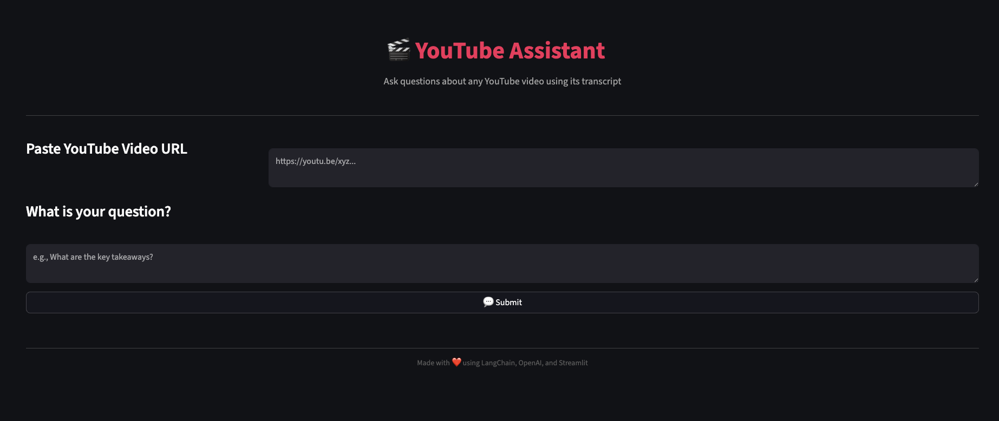
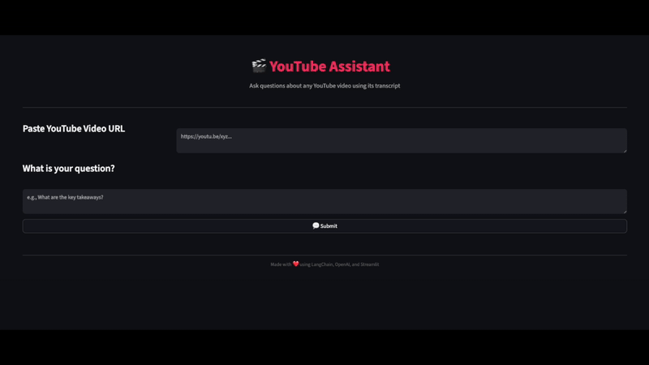

# 🎬 YouTube Assistant

A sleek Streamlit web app powered by **LangChain**, **OpenAI**, and **FAISS** that lets you ask questions about any YouTube video by leveraging its transcript.

---

## 🚀 Features

- **Ask questions** about YouTube videos via URL input
- Retrieval-augmented generation (RAG) using transcript embeddings
- **Flexible answer style**: short or detailed, configurable via prompt
- **Modern UI** with Streamlit: spinners, cards, responsive layout

---

## 📸 UI



---

## 📸 In Action



---

## 🛠️ Getting Started

### 1. Clone the Repo

```bash
git clone https://github.com/abhinavdubeyad9/youtube-assistant-langchain-openai.git
cd youtube-assistant-langchain-openai
```

### 2. Install Dependencies

```bash
pip install -r requirements.txt
```

### 3. Add Your OpenAI API Key

Create a `.env` file in the root directory:

```env
OPENAI_API_KEY=sk-...
```

Or export it directly in your terminal:

```bash
export OPENAI_API_KEY=sk-...
```

### 4. Run the App

```bash
streamlit run main.py
```

Then open your browser at [http://localhost:8501](http://localhost:8501).

---

## 🧠 How It Works

1. **Transcript Loading**  
   Uses `YoutubeLoader` to extract video transcripts from YouTube URLs.

2. **Text Chunking & Embedding**  
   Splits transcripts into chunks using `RecursiveCharacterTextSplitter` and vectorizes them using `OpenAIEmbeddings` and FAISS index.

3. **Similarity Search**  
   Retrieves top-_k_ transcript chunks relevant to the user’s query.

4. **LLM-Powered Answering**  
   Uses `ChatOpenAI` (e.g., `gpt-4o-mini` or `gpt-3.5-turbo`) via LangChain to generate fact-based answers from the retrieved chunks.

---

## 🔧 Prompt Configuration

Customize the prompt in `langchain_helper.py`:

```python
template = """
You are a helpful assistant that that can answer questions about youtube videos
        based on the video's transcript.

        Answer the following question: {question}
        By searching the following video transcript: {docs}

        Only use the factual information from the transcript to answer the question.

        If you feel like you don't have enough information to answer the question, say "I don't know".

        Avoid long explanations — keep your answer short and to the point, no more than 5-6 sentences.
"""
```

- **Verbose mode**: Use a longer, more detailed prompt
- **Bullet-point mode**: Add `"Respond in 3 bullet points"` at the end

---

## 🧩 Project Structure

```
.
├── main.py               # Streamlit UI
├── langchain_helper.py  # Transcript loader, vector DB, response logic
├── requirements.txt      # Dependencies
├── .env                  # (Optional) your OPENAI_API_KEY
└── assets/               # Screenshots, icons, etc.
```

---

## 📈 Future Enhancements

- UI toggle for **Concise** vs **Detailed** responses
- Transcript **preview or download**
- Embed **audio player** to listen to video segments
- One-click deployment to **Heroku**, **Vercel**, or **Azure**

---

## 🙌 Contributing

Contributions, feedback, and bug reports are welcome!

1. Fork this repo
2. Create a feature branch (`git checkout -b feature-name`)
3. Commit your changes (`git commit -m "Add feature"`)
4. Push to your branch (`git push origin feature-name`)
5. Open a Pull Request

---

## ✅ License & Author

- **License**: MIT
- **Author**: [Abhinav Dubey](https://github.com/abhinavdubeyad9)

---

**Made with ❤️ using LangChain, OpenAI, and Streamlit**
